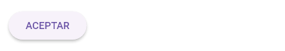
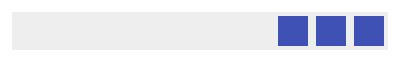
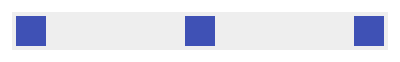
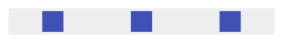
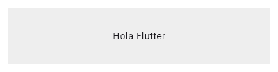
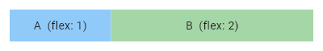
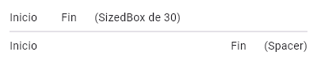
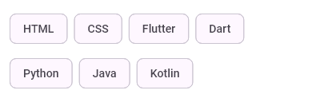
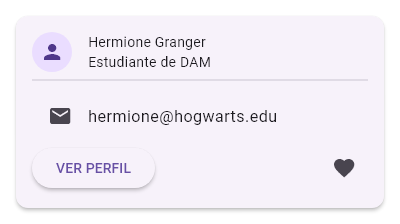

# UT1 · Fundamentos de Flutter

Apuntes de Desarrollo de Interfaces (2º DAM 2026-2027). Siguen el orden del temario oficial (*UT 1 Fundamentos de Flutter*, 4 sesiones) y añaden mis notas de clase del 17/09 y el 18/09/2026 y la práctica 1.6.

> ✏️ **Corrección** = algo que quedó mal apuntado en clase · ➕ **Ampliación** = no está en el temario, pero ayuda.

> 🖼️ Las imágenes son **capturas reales** de Flutter 3.47 (Material 3). Para verlas en vivo, pega [`galeria_widgets.dart`](galeria_widgets.dart) en [dartpad.dev](https://dartpad.dev) y pulsa **Run**.

## Índice

1. [Sesión 1 · Qué es Flutter](#sesion-1-que-es-flutter)
2. [Sesión 2 · Anatomía de una app Flutter](#sesion-2-anatomia-de-una-app-flutter)
3. [Sesión 3 · Widgets básicos y composición](#sesion-3-widgets-basicos-y-composicion)
4. [Sesión 4 · Layout y distribución de widgets](#sesion-4-layout-y-distribucion-de-widgets)
5. [Práctica 1.6 · Layout de un perfil de alumno](#practica-16-layout-de-un-perfil-de-alumno)
6. [Chuleta de widgets](#chuleta-de-widgets)
7. [Preguntas para repasar](#preguntas-para-repasar)

---

## Sesión 1 · Qué es Flutter

### 1.1 Interfaz gráfica (GUI)

Una **GUI** (*Graphical User Interface*) es **la parte visual de una aplicación con la que interactúa el usuario**: pantallas, textos, imágenes, botones, campos de texto, menús, listas… El objetivo de este módulo es aprender a **construir interfaces**, no un lenguaje concreto.

### 1.2 Desarrollo nativo y multiplataforma

Si queremos una app para **Android y para iOS** tenemos dos caminos:

**Desarrollo nativo:** una app distinta para cada plataforma, con su tecnología propia.

```
              NUESTRA APP
                   │
          ┌────────┴────────┐
       ANDROID             iOS
     Kotlin / Java        Swift
          │                 │
   App para Android    App para iOS
```

- ✅ Aprovecha al máximo cada sistema operativo.
- ❌ Hay que **escribir y mantener dos códigos** distintos.

**Desarrollo multiplataforma:** un solo proyecto que sirve para varias plataformas.

```
              UN PROYECTO
                   │
      Tecnología multiplataforma
          ┌────────┴────────┐
       ANDROID             iOS
```

- ✅ Se **comparte la mayor parte del código**.
- Las dos tecnologías más conocidas son **React Native** y **Flutter**.

### 1.3 React Native y Flutter

**React Native:** framework de código abierto que usa **React con JavaScript o TypeScript**. La interfaz se construye con **componentes**:

```jsx
<View>
  <Text>Hola</Text>
  <Button title="Aceptar" />
</View>
```

**Flutter:** **SDK** multiplataforma de Google que usa el lenguaje **Dart**. La interfaz se construye con **widgets**:

```dart
Column(
  children: [
    Text('Hola'),
    ElevatedButton(
      onPressed: () {},
      child: Text('Aceptar'),
    ),
  ],
)
```

En los dos casos unos elementos van dentro de otros y se forma una **estructura jerárquica**. En Flutter se llama **árbol de widgets** (*Widget Tree*):

```
Column
├── Text  "Hola"
└── ElevatedButton
    └── Text  "Aceptar"
```

| Característica | Flutter | React Native |
|---|---|---|
| Lenguaje | **Dart** | JavaScript / TypeScript |
| La UI se construye con | **Widgets** | Componentes |
| Modelo de interfaz | Declarativo | Declarativo |
| Android / iOS | Sí / Sí | Sí / Sí |
| Hot Reload (ver cambios al instante) | Sí | Sí |
| Crear componentes propios | Sí | Sí |

> **React Native no es "peor" que Flutter.** La elección depende del proyecto y del equipo. Una empresa con gente experta en React y TypeScript puede elegir React Native con toda la razón. (Además, React Native lo veréis en **PMDM**, UT2).

### 1.4 ¿Por qué Flutter en este módulo?

Porque en Flutter se ve muy claro **cómo se construye una interfaz**:

```
INTERFAZ
   │
ÁRBOL DE WIDGETS
   ├── WIDGETS      (qué hay)
   ├── PROPIEDADES  (cómo es)
   └── EVENTOS      (qué pasa al interactuar)
```

Lo que iremos aprendiendo durante el curso, en orden:

```
usar widgets → organizarlos → cambiar sus propiedades → responder a eventos
→ gestionar el estado → crear widgets propios → apps completas
```

Más adelante también se trabajará con **sensores, cámara, localización y voz**.

### 1.5 Flutter es **declarativo**

Imagina una app con **modo claro y modo oscuro** controlada por una variable:

```dart
bool modoOscuro = false;
```

Al pulsar el botón, `modoOscuro` pasa a `true` y todo debe cambiar: fondo, textos y botón.

**Modelo imperativo:** le dices al programa **qué cambios hacer, paso a paso**:

```
Cambia el fondo a oscuro → cambia el título a blanco → cambia el texto a blanco
→ cambia el aspecto del botón → cambia el texto del botón
```

**Modelo declarativo (Flutter):** describes **cómo debe ser la interfaz para cada estado** y Flutter se encarga de redibujarla:

```
modoOscuro = false  ──►  INTERFAZ CLARA
modoOscuro = true   ──►  INTERFAZ OSCURA
```

Tú solo cambias **el estado** (la variable) y la interfaz se actualiza sola. Se resume así:

```
INTERFAZ = f(estado)
```

La interfaz es **una función del estado**: mismo estado, misma interfaz.

| | Imperativo | Declarativo |
|---|---|---|
| Qué escribes | **Los cambios** que hay que hacer | **Cómo debe ser** la interfaz |
| Quién actualiza la pantalla | Tú, paso a paso | El framework |

React Native también es declarativo; no es algo exclusivo de Flutter.

### 1.6 En Flutter casi todo es un widget

Los **widgets** son las piezas con las que se construye la interfaz. Hay dos tipos:

- **Muestran contenido:** `Text` (texto), `Image` (imagen), `Icon` (icono), `ElevatedButton` (botón).
- **Organizan a otros widgets:** `Column` (en vertical), `Row` (en horizontal)…

Combinándolos se forma el árbol:

```
Column
├── Icon
├── Text
├── Text
└── Row
    ├── ElevatedButton
    └── ElevatedButton
```

### 🎯 Idea clave de la sesión 1

```
INTERFAZ VISUAL  ↕  ÁRBOL DE WIDGETS  ↕  CÓDIGO DART
```

Hay que saber **pasar de una representación a otra** en cualquier dirección.

---

## Sesión 2 · Anatomía de una app Flutter

### 2.1 La app mínima

```dart
import 'package:flutter/material.dart';  // Trae los widgets de Material Design

void main() {
  runApp(
    MaterialApp(
      home: Scaffold(
        body: Center(
          child: Text('Hola Flutter'),
        ),
      ),
    ),
  );
}
```

### 2.2 Cómo leer el código: mayúsculas y minúsculas

*(De mis notas de clase)*

- Lo que empieza por **Mayúscula** es un **widget** (una clase): `Scaffold`, `Center`, `Text`…
- Lo que empieza por **minúscula** seguido de `:` es una **propiedad** (un parámetro con nombre): `home:`, `body:`, `child:`…

```dart
Icon(              // Widget
  Icons.school,    // Primer parámetro: qué icono
  size: 60,        // Propiedad
)
```

### 2.3 Pieza a pieza

**`main()`: el punto de partida.** Cuando ejecutas el programa, Dart busca `main()` y empieza por ahí. `main()` es **de Dart, no de Flutter**: también existe en programas Dart sin interfaz (igual que el `main` de Java).

**`runApp()`: arranca Flutter.** Es una **función de Flutter** que recibe un widget y lo pone como **raíz de toda la interfaz**. `runApp(MaterialApp(...))` se lee como *"arranca la app usando `MaterialApp` como widget raíz"*.

**`MaterialApp`: la aplicación.** Configura la **app entera** con el estilo **Material Design** de Google. Más adelante servirá para el tema, los colores, la navegación… De momento solo usamos una propiedad:

- **`home:`** → la **pantalla inicial** de la app.

**`Scaffold`: la estructura de una pantalla.** Las apps móviles suelen tener zonas fijas (barra arriba, contenido, botones…). `Scaffold` es el **esqueleto de una pantalla** con esos huecos ya preparados:

```
┌──────────────────────────────┐
│            AppBar            │  ← appBar:   barra superior
├──────────────────────────────┤
│                              │
│             body             │  ← body:     contenido principal
│                              │
│                         [ + ]│  ← floatingActionButton: botón flotante
└──────────────────────────────┘
```

> ✏️ **Corrección:** en mis notas puse "configura la aplicación en Material Design" al lado de `Scaffold`. Eso lo hace **`MaterialApp`**. `Scaffold` es la estructura de **una pantalla**.

### 2.4 Seguir el código hasta la pantalla

```
main()
 └── runApp()
      └── MaterialApp
           └── Scaffold
                └── Center
                     └── Text  "Hola Flutter"
```

Resultado: "Hola Flutter" centrado en la pantalla.

> **Hay una relación directa entre la estructura del código y la estructura de la interfaz.**

### 2.5 Añadir una barra superior

```dart
Scaffold(
  appBar: AppBar(
    title: Text('Mi primera app'),
  ),
  body: Center(
    child: Text('Hola Flutter'),
  ),
)
```

```
Scaffold
├── appBar ──► "Mi primera app"   (barra arriba)
└── body   ──► "Hola Flutter"     (centro)
```

Fíjate en que **no hemos dibujado ninguna barra**. Solo hemos dicho que el `Scaffold` *tiene* un `AppBar` y Flutter la construye (otra vez la idea **declarativa**).

> ➕ **Ampliación:** el botón `[ + ]` se pone así:
>
> ```dart
> Scaffold(
>   floatingActionButton: FloatingActionButton(
>     onPressed: () {},
>     child: Icon(Icons.add),
>   ),
> )
> ```

### 2.6 Leer en las dos direcciones

- Del **código** a la **interfaz**: ver un `Scaffold` con `appBar` y `body` e imaginar la pantalla.
- De la **interfaz** al **código**: ver una pantalla con título y un texto centrado y pensar *"`Scaffold` + `AppBar` + `Center` + `Text`"*.

### 🎯 Resumen de la sesión 2

| Elemento | Función |
|---|---|
| `main()` | Punto de entrada del programa Dart |
| `runApp()` | Arranca la interfaz Flutter con un widget raíz |
| `MaterialApp` | Configura la aplicación con Material Design |
| `home` | Pantalla inicial |
| `Scaffold` | Estructura básica de una pantalla |
| `appBar` | Barra superior |
| `body` | Contenido principal |

> **Lo que ves en pantalla es el resultado de un árbol de widgets escrito en código.**

---

## Sesión 3 · Widgets básicos y composición

### 3.1 `child` y `children`

Es **la distinción más importante** para construir interfaces.

**`child`: UN solo hijo.**

```dart
ElevatedButton(
  onPressed: () {},
  child: Text('ACEPTAR'),
)
```

```
ElevatedButton
└── Text
```

**`children`: VARIOS hijos** (una lista entre corchetes `[ ]`).

```dart
Column(
  children: [
    Icon(Icons.person),
    Text('Harry Potter'),
    Text('harry@email.com'),
  ],
)
```

```
Column
├── Icon
├── Text
└── Text
```

```
child     → UN widget hijo
children  → VARIOS widgets hijos  [ ... ]
```

> ⚠️ Fíjate siempre en los **hijos directos**. Una `Card` con una `Column` de 3 textos dentro **tiene un solo hijo** (la `Column`), así que usa `child`, aunque en pantalla se vean 3 cosas.

### 3.2 `Column` y `Row`

| | `Column` | `Row` |
|---|---|---|
| Coloca a sus hijos | **Uno debajo de otro** ↓ | **Uno al lado de otro** → |
| Usa | `children` | `children` |

```dart
Column(                         Row(
  children: [                     children: [
    Icon(Icons.person),             Icon(Icons.email),
    Text('Harry Potter'),           Text('harry@email.com'),
    Text('harry@email.com'),      ],
  ],                            )
)
```

```
       👤                        ✉ harry@email.com
   Harry Potter
 harry@email.com
```

| `Column` | `Row` |
|---|---|
|  |  |

### 3.3 Anidar widgets

Un widget puede contener otros, y estos otros más. Así se construyen interfaces complejas:

```dart
Column(
  children: [
    Icon(Icons.person),
    Text('Harry Potter'),
    Text('Estudiante de DAM'),
    Row(
      children: [
        Icon(Icons.email),
        Text('harry@email.com'),
      ],
    ),
    ElevatedButton(
      onPressed: () {},
      child: Text('VER PERFIL'),
    ),
  ],
)
```

```
Column                 ← children: tiene varios hijos
├── Icon
├── Text
├── Text
├── Row                ← children: tiene varios hijos
│   ├── Icon
│   └── Text
└── ElevatedButton     ← child: tiene un solo hijo
    └── Text
```

### 3.4 Widgets básicos

| Widget | Para qué sirve | Ejemplo |
|---|---|---|
| `Text` | Mostrar texto | `Text('Harry Potter')` |
| `Icon` | Mostrar un icono | `Icon(Icons.school, size: 60)` |
| `Image` | Mostrar una imagen | `Image.network('https://...')` (de Internet; las del proyecto se verán más adelante) |
| `ElevatedButton` | Botón con relieve | `ElevatedButton(onPressed: () {}, child: Text('ACEPTAR'))` |
| `IconButton` | Botón que es solo un icono | `IconButton(onPressed: () {}, icon: Icon(Icons.favorite))` |
| `CircleAvatar` | Contenido dentro de un círculo (fotos de perfil) | `CircleAvatar(child: Icon(Icons.person))` |
| `Divider` | Línea horizontal para separar contenido | `Divider()` (sin hijos) |
| `Card` | Tarjeta que agrupa contenido relacionado | `Card(child: Column(...))` |
| `ListTile` | Fila ya montada con icono, título y subtítulo | ver abajo |

**Detalles importantes:**

- `onPressed: () {}` es una **función vacía**: el botón funciona pero de momento no hace nada. Con `onPressed: null` el botón sale **desactivado** (en gris).
- `IconButton` no usa `child`, usa **`icon:`**, una propiedad con nombre específico.
- `Divider` **no tiene hijos**: solo dibuja una línea.

**Así se ven:**

| Widget | Render |
|---|---|
| `Text` |  |
| `Icon` |  |
| `ElevatedButton` |  |
| `ElevatedButton (onPressed: null)` |  |
| `IconButton` |  |
| `CircleAvatar` |  |
| `Divider` |  |
| `Card` |  |
| `ListTile` |  |

**`ListTile`: información organizada en una fila.** Es un widget que **ya combina varios elementos** típicos:

```dart
ListTile(
  leading: Icon(Icons.email),           // al principio
  title: Text('Correo electrónico'),    // contenido principal
  subtitle: Text('harry@email.com'),    // contenido secundario
)
```

```
✉  Correo electrónico
   harry@email.com
```

| Propiedad | Zona |
|---|---|
| `leading` | Al principio (normalmente un icono o avatar) |
| `title` | Contenido principal |
| `subtitle` | Contenido secundario, debajo del título |

Se pueden combinar varios en una `Column`, separados con `Divider()`.

### 3.5 Construir una interfaz: primero la estructura

**No empieces escribiendo código.** El método es:

```
INTERFAZ → ¿QUÉ WIDGETS NECESITO? → ¿CÓMO SE RELACIONAN? → ÁRBOL DE WIDGETS → CÓDIGO
```

**Ejemplo:** pantalla de perfil.

```
          👤
      Laura Pérez
   Estudiante de DAM
────────────────────
✉  laura@email.com
☎  600 123 456
     [ VER PERFIL ]
```

1. **¿Qué widgets aparecen?** `CircleAvatar`, `Text`, `Text`, `Divider`, `ListTile`, `ListTile`, `ElevatedButton`.
2. **¿Cómo están organizados?** Todos uno debajo de otro, así que van en una `Column`.
3. **Árbol:**

```
Column
├── CircleAvatar
│   └── Icon
├── Text
├── Text
├── Divider
├── ListTile
├── ListTile
└── ElevatedButton
    └── Text
```

4. **Código:**

```dart
Column(
  children: [
    CircleAvatar(child: Icon(Icons.person)),
    Text('Laura Pérez'),
    Text('Estudiante de DAM'),
    Divider(),
    ListTile(
      leading: Icon(Icons.email),
      title: Text('laura@email.com'),
    ),
    ListTile(
      leading: Icon(Icons.phone),
      title: Text('600 123 456'),
    ),
    ElevatedButton(
      onPressed: () {},
      child: Text('VER PERFIL'),
    ),
  ],
)
```

### 3.6 Centrar dentro de una fila o columna

```dart
mainAxisAlignment: MainAxisAlignment.center
```

Centra los hijos **en el eje principal**: en vertical si es una `Column`, en horizontal si es una `Row`. Se explica a fondo en la sesión 4.

### Ejemplo de clase (17/09): tarjeta de Harry Potter

```dart
import 'package:flutter/material.dart';

void main() {
  runApp(
    MaterialApp(
      home: Scaffold(
        body: Center(
          child: Column(
            mainAxisAlignment: MainAxisAlignment.center,  // centrado en vertical
            children: [
              Icon(Icons.school, size: 60),
              Text('Harry Potter'),
              Text('harry@email.com'),
              Row(
                mainAxisAlignment: MainAxisAlignment.center,  // botones centrados en horizontal
                children: [
                  ElevatedButton(onPressed: () {}, child: Text('EDITAR')),
                  ElevatedButton(onPressed: () {}, child: Text('SALIR')),
                ],
              ),
            ],
          ),
        ),
      ),
    ),
  );
}
```

```
Center
└── Column
    ├── Icon (school)
    ├── Text ('Harry Potter')
    ├── Text ('harry@email.com')
    └── Row
        ├── ElevatedButton → Text ('EDITAR')
        └── ElevatedButton → Text ('SALIR')
```

Los dos botones salen pegados. Para separarlos, pon un `SizedBox(width: 16)` entre ellos (sesión 4).

### 🎯 Al terminar la sesión 3 debes saber

- Reconocer los widgets más habituales.
- Distinguir `child` de `children`.
- Combinar widgets con `Row` y `Column` y anidarlos.
- Pasar de una interfaz a su árbol, y del árbol al código.

---

## Sesión 4 · Layout y distribución de widgets

En Flutter **el layout también se hace con widgets**. Unos **muestran contenido** (`Text`, `Image`, `Icon`) y otros sirven para **organizar, dar tamaño o colocar** a otros widgets. Esta sesión responde a:

- ¿Cómo **centro** un elemento?
- ¿Cómo **separo** dos widgets?
- ¿Cómo hago que algo **ocupe el espacio libre**?
- ¿Cómo **reparto** elementos por la pantalla?
- ¿Cómo pongo un widget **encima de otro**?

### 4.1 Los dos ejes de `Row` y `Column`

Todo `Row` y toda `Column` tienen **dos ejes**:

- **Eje principal:** la dirección en la que coloca a sus hijos.
- **Eje transversal (cruzado):** el perpendicular.

```
ROW                                   COLUMN
         eje transversal ↓                     eje transversal →
  [ A ]   [ B ]   [ C ]                      [ A ]
  ─────────────────────→                     [ B ]
       eje principal                         [ C ]
                                               ↓ eje principal
```

| | `mainAxisAlignment` (eje principal) | `crossAxisAlignment` (eje transversal) |
|---|---|---|
| **Row** | Horizontal ↔ | Vertical ↕ |
| **Column** | Vertical ↕ | Horizontal ↔ |

> ⚠️ **Cuidado:** la **misma propiedad** controla una dirección distinta según sea `Row` o `Column`.

### 4.2 `mainAxisAlignment`: repartir en el eje principal

```dart
Row(
  mainAxisAlignment: MainAxisAlignment.center,
  children: [
    Icon(Icons.home),
    Icon(Icons.search),
    Icon(Icons.settings),
  ],
)
```

| Valor | Resultado |
|---|---|
| `start` (por defecto) | `[■][■][■]-------------------` |
| `center` | `----------[■][■][■]----------` |
| `end` | `-------------------[■][■][■]` |
| `spaceBetween` | `[■]----------[■]----------[■]` (sin hueco en los bordes) |
| `spaceAround` | `---[■]------[■]------[■]---` (en los bordes, la mitad de hueco) |
| `spaceEvenly` | `-----[■]-----[■]-----[■]-----` (todos los huecos iguales) |

**Render real** (`Row` con 3 cuadrados sobre fondo gris):

| Valor | Render |
|---|---|
| `start` |  |
| `center` |  |
| `end` |  |
| `spaceBetween` |  |
| `spaceAround` |  |
| `spaceEvenly` |  |

### 4.3 `crossAxisAlignment`: el otro eje

```dart
Column(
  crossAxisAlignment: CrossAxisAlignment.start,  // todo pegado a la izquierda
  children: [
    Text('Laura Pérez'),
    Text('2.º DAM'),
    Text('Desarrollo de Interfaces'),
  ],
)
```

En una `Column` el eje transversal es **horizontal**, así que `start` coloca los textos **a la izquierda**.

 Si no se pone nada, salen **centrados**. Valores habituales: `start`, `center`, `end` y `stretch` (estirar para ocupar todo).

### 4.4 ¿Por qué unos tienen `child`, otros `children` y otros ninguno?

| Tipo | Propiedad | Widgets |
|---|---|---|
| Trabajan con **un** widget | `child` | `Center`, `Padding`, `Expanded`, `Card`, `SizedBox`, `Container`, `Positioned`, `ElevatedButton`, `CircleAvatar` |
| Organizan **varios** widgets | `children` | `Row`, `Column`, `Stack`, `Wrap` |
| **Son** el contenido | ninguna | `Text`, `Icon`, `Image`, `Divider` |
| Huecos con **función concreta** | nombre propio | `title`, `subtitle`, `leading` (ListTile), `icon` (IconButton), `appBar`, `body` (Scaffold) |

La documentación oficial de Flutter separa los widgets de layout en **de un solo hijo** (*single-child*) y **de varios hijos** (*multi-child*).

```
child               → un hueco para un widget
children            → una lista de widgets
title, icon, leading… → huecos con una función concreta
```

### 4.5 `Center`: centrar

```dart
Center(
  child: Text('Hola Flutter'),
)
```

Coloca a su `child` **en el centro del espacio disponible**.



*(Fondo gris = el espacio disponible)*

### 4.6 `Padding`: espacio alrededor

```dart
Padding(
  padding: EdgeInsets.all(20),
  child: Text('Hola Flutter'),
)
```

Añade **espacio alrededor de su hijo**, por dentro.


*(Gris = los 20 de padding · ámbar = el hijo)* Con **`EdgeInsets`** se dice cuánto espacio y en qué lados:

| Forma | Qué hace |
|---|---|
| `EdgeInsets.all(20)` | 20 en **los cuatro lados** |
| `EdgeInsets.symmetric(horizontal: 20, vertical: 10)` | 20 a izquierda y derecha, 10 arriba y abajo |
| `EdgeInsets.only(left: 20, top: 10)` | Solo en los lados que indiques |

### 4.7 `SizedBox`: tamaño fijo y separación

**Como hueco** (sin hijo), para separar widgets:

```dart
Column(
  children: [
    Text('Nombre'),
    SizedBox(height: 20),   // 20 de separación vertical
    Text('Correo'),
  ],
)
```

Usa `height` dentro de una `Column` y `width` dentro de una `Row`.


**Para dar tamaño** (con hijo), fuerza el tamaño de otro widget:

```dart
SizedBox(
  width: 200,
  height: 50,
  child: ElevatedButton(
    onPressed: () {},
    child: Text('ENTRAR'),
  ),
)
```


### 4.8 `Expanded`: ocupar el espacio libre

Dentro de una `Row`, `Column` o `Flex`, `Expanded` hace que su hijo **se estire para ocupar el espacio que sobra**:

```dart
Row(
  children: [
    Text('Nombre'),
    Expanded(
      child: Text('Laura Pérez'),   // ocupa todo lo que queda de la fila
    ),
  ],
)
```

**Con varios `Expanded`** el espacio se **reparte a partes iguales**. Con **`flex`** se reparte en proporción:

```dart
Row(
  children: [
    Expanded(flex: 1, child: Text('A')),
    Expanded(flex: 2, child: Text('B')),
  ],
)
```

```
┌──────────┬────────────────────┐
│    A     │         B          │    B recibe el doble que A (1 : 2)
└──────────┴────────────────────┘
```



> ⚠️ `Expanded` **solo funciona dentro de `Row`, `Column` o `Flex`**. Fuera de ellos da error.

### 4.9 `Spacer`: espacio flexible

```dart
Row(children: [Text('Inicio'), SizedBox(width: 30), Text('Fin')])
// Inicio ←30→ Fin------------------------

Row(children: [Text('Inicio'), Spacer(), Text('Fin')])
// Inicio-------------------------------Fin
```

| | Tipo de espacio | Cuándo |
|---|---|---|
| `SizedBox` | **Fijo** ("quiero 30 de hueco") | Separar elementos una cantidad concreta |
| `Spacer` | **Flexible** ("todo el espacio que sobre") | Empujar elementos a los extremos |



### 4.10 `Stack`: unos encima de otros

`Row` coloca uno al lado del otro y `Column` uno debajo del otro. **`Stack` los superpone como capas**: el primero de la lista queda al fondo y el último, encima.

```dart
Stack(
  children: [
    Image.network('...'),       // capa de abajo
    Icon(Icons.favorite),       // capa de encima
  ],
)
```

### 4.11 `Positioned`: colocar dentro de un `Stack`

Sirve para decir **dónde** va un elemento dentro del `Stack`:

```dart
Stack(
  children: [
    Image.network('...'),
    Positioned(
      top: 10,       // 10 desde arriba
      right: 10,     // 10 desde la derecha
      child: Icon(Icons.favorite),
    ),
  ],
)
```

```
┌──────────────────────────────┐
│                         ♥    │ ← top 10, right 10
│          IMAGEN              │
└──────────────────────────────┘
```

Propiedades: `top`, `bottom`, `left`, `right`.


> **¿Por qué `Stack` usa `children` y `Positioned` usa `child`?** Porque `Stack` organiza **varios** elementos y cada `Positioned` coloca **uno** concreto.

### 4.12 `Wrap`: cuando no cabe

Con una `Row`, si los elementos no caben en horizontal hay **desbordamiento** (*overflow*: Flutter pinta una franja amarilla y negra). `Wrap` **salta a la línea siguiente**:

```
[HTML] [CSS] [Flutter] [Dart]
[Python] [Java]
```

```dart
Wrap(
  spacing: 8,      // separación entre elementos
  runSpacing: 8,   // separación entre líneas
  children: [
    Chip(label: Text('HTML')),
    Chip(label: Text('CSS')),
    Chip(label: Text('Flutter')),
    Chip(label: Text('Dart')),
  ],
)
```

`Chip` es una "etiqueta" pequeña con bordes redondeados.



> ✏️ **Corrección:** en mis notas puse "Warp". El widget se llama **`Wrap`** (envolver).

### 4.13 `Container`: el todoterreno

Combina en un solo widget **tamaño, padding, margen, fondo, bordes, decoración y un `child`**:

```dart
Container(
  width: 250,
  padding: EdgeInsets.all(16),   // espacio POR DENTRO
  margin: EdgeInsets.all(10),    // espacio POR FUERA
  child: Text('Desarrollo de Interfaces'),
)
```

| | `margin` | `padding` |
|---|---|---|
| Dónde | **Fuera** del widget (lo separa de los demás) | **Dentro** (entre el borde y el contenido) |


*(Gris = margin · ámbar = padding + contenido)*

> ⚠️ **Que `Container` pueda hacerlo todo no significa que haya que usarlo para todo.** Usa el widget específico, porque deja más claro qué quieres hacer:
>
> - ¿Solo espacio alrededor? → `Padding`
> - ¿Solo un hueco fijo? → `SizedBox`
> - ¿Solo centrar? → `Center`

### 4.14 Construir un layout: pensar antes de programar

Antes de escribir código, mira la interfaz y hazte estas preguntas **en orden**:

```
1. ¿Vertical u horizontal?               → Column / Row
2. ¿Qué elementos van agrupados?         → Card, Row/Column anidadas
3. ¿Hay que separar elementos?           → SizedBox, Padding, Divider
4. ¿Alguno ocupa el espacio libre?       → Expanded, Spacer
5. ¿Hay elementos superpuestos?          → Stack + Positioned
```

**Ejemplo:** tarjeta de Hermione.

```
┌────────────────────────────────────┐
│  👤  Hermione Granger              │
│      Estudiante de DAM             │
│  ────────────────────────────────  │
│  ✉  hermione@hogwarts.edu          │
│  [ VER PERFIL ]               ♥    │
└────────────────────────────────────┘
```

Árbol:

```
Card
└── Padding
    └── Column
        ├── Row
        │   ├── CircleAvatar
        │   ├── SizedBox
        │   └── Column
        │       ├── Text
        │       └── Text
        ├── Divider
        ├── ListTile
        └── Row
            ├── ElevatedButton
            ├── Spacer
            └── IconButton
```

Código (el temario solo da el árbol; este es el código que le corresponde):

```dart
Card(
  child: Padding(
    padding: EdgeInsets.all(16),
    child: Column(
      children: [
        Row(
          children: [
            CircleAvatar(child: Icon(Icons.person)),
            SizedBox(width: 16),
            Column(
              crossAxisAlignment: CrossAxisAlignment.start,  // textos alineados a la izquierda
              children: [
                Text('Hermione Granger'),
                Text('Estudiante de DAM'),
              ],
            ),
          ],
        ),
        Divider(),
        ListTile(
          leading: Icon(Icons.email),
          title: Text('hermione@hogwarts.edu'),
        ),
        Row(
          children: [
            ElevatedButton(onPressed: () {}, child: Text('VER PERFIL')),
            Spacer(),                                   // empuja el corazón a la derecha
            IconButton(onPressed: () {}, icon: Icon(Icons.favorite)),
          ],
        ),
      ],
    ),
  ),
)
```

**Resultado:**



### 4.15 Flutter Inspector

Cuando la interfaz crece, leer solo el código se hace difícil. **Flutter Inspector** (en VS Code o Android Studio, con la app en marcha) **muestra el árbol de widgets en vivo**. Al pulsar un widget en la pantalla te lleva a su sitio en el árbol y en el código. Sirve para relacionar:

```
INTERFAZ VISUAL  ↕  ÁRBOL DE WIDGETS  ↕  CÓDIGO DART
```

### 4.16 Idea importante: las restricciones del layout

En Flutter **el padre decide cuánto espacio puede ocupar su hijo**. Por eso poner `width: 200` no siempre da exactamente lo que esperas. La regla que resume el sistema de layout de Flutter:

```
Las restricciones bajan  (el padre le dice al hijo: "puedes medir entre X e Y")
Los tamaños suben        (el hijo responde: "mido Z")
El padre coloca          (el padre decide dónde va el hijo)
```

Se verá a fondo cuando aparezcan los primeros problemas de tamaño u *overflow*.

---

## Práctica 1.6 · Layout de un perfil de alumno

*(Cuestionario "Construcción del layout de una interfaz". Código en `1.6-Cuestionario.../lib/main.dart`)*

```
Scaffold
├── appBar: AppBar ('LAYOUTS')
└── body: Container (margin 20, padding 24)
    └── Column
        ├── Row  ← cabecera
        │   ├── Icon (account_circle, 50)
        │   ├── SizedBox (width 16)
        │   ├── Column ('LAURA PÉREZ', 'Desarrollo de Interfaces')
        │   ├── Spacer()             ← empuja lo siguiente a la derecha
        │   └── Column ('2.ºDAM', Icon settings)
        ├── Card ('MI PROGRESO', alto 90)
        ├── Text ('MIS MÓDULOS')
        ├── SizedBox (height 12)
        ├── Row  ← dos tarjetas a partes iguales
        │   ├── Expanded → Card (Icon phone_android, 'FLUTTER', '8 h')
        │   ├── SizedBox (width 16)
        │   └── Expanded → Card (Icon language, 'WEB', '12 h')
        └── Card (alto 120)
            └── Stack  ← capas superpuestas
```

Técnicas de la sesión 4 que aplica:

- **`Spacer()` en la cabecera:** separa el nombre del bloque del curso.
- **`Expanded` + `SizedBox`:** dos tarjetas del mismo ancho con un hueco en medio.
- **`MainAxisAlignment.spaceEvenly`** dentro de cada tarjeta, para repartir el icono y los textos.
- **`Card` + `SizedBox(height: ...)`:** tarjetas con un alto fijo.
- **`Stack`:** elementos superpuestos (con `Positioned` para colocarlos en una posición exacta).

> ➕ **Mejora posible:** el `Container` del `body` solo usa `margin` y `padding`. Según la advertencia de la sección 4.13, un `Padding(padding: EdgeInsets.all(44), ...)` haría lo mismo, ya que 20 + 24 = 44 y no hay fondo ni borde que distinga margen de relleno.

---

## Buenas costumbres (ampliación)

> ➕ **`const`:** si un widget no cambia nunca, ponle `const` delante: `const Text('Hola')`, `const SizedBox(height: 12)`. Flutter no lo vuelve a construir en cada repintado. El analizador lo sugiere subrayándolo en azul.
>
> ➕ **Coma final:** pon siempre `,` después del último parámetro. Así el formateador (`dart format`, o Shift+Alt+F en VS Code) coloca cada widget en su línea y el árbol se lee mucho mejor.
>
> ➕ **Hot Reload:** con la app en marcha, al guardar (Ctrl+S) los cambios aparecen al instante sin reiniciar la app.

---

## Chuleta de widgets

| Widget | Hijos | Para qué |
|---|---|---|
| `MaterialApp` | `home` | La app (Material Design) |
| `Scaffold` | `appBar`, `body`, `floatingActionButton` | Estructura de una pantalla |
| `AppBar` | `title` | Barra superior |
| `Text` | — | Texto |
| `Icon` | — | Icono (`Icons.xxx`, `size`) |
| `Image.network` | — | Imagen de Internet |
| `Divider` | — | Línea separadora |
| `ElevatedButton` | `child` | Botón (`onPressed`) |
| `IconButton` | `icon` | Botón de solo icono |
| `CircleAvatar` | `child` | Círculo de perfil |
| `Card` | `child` | Tarjeta que agrupa contenido |
| `ListTile` | `leading`, `title`, `subtitle` | Fila con icono + título + subtítulo |
| `Center` | `child` | Centrar |
| `Padding` | `child` | Espacio alrededor (`EdgeInsets`) |
| `SizedBox` | `child` (opcional) | Hueco fijo o tamaño fijo |
| `Expanded` | `child` | Ocupar el espacio libre (`flex`) |
| `Spacer` | — | Espacio flexible |
| `Container` | `child` | Tamaño + margin + padding + decoración |
| `Row` | `children` | Horizontal → |
| `Column` | `children` | Vertical ↓ |
| `Stack` | `children` | Capas superpuestas |
| `Positioned` | `child` | Posición dentro de un `Stack` |
| `Wrap` | `children` | Fila con salto de línea (`spacing`, `runSpacing`) |
| `Chip` | `label` | Etiqueta pequeña |

---

## Preguntas para repasar

1. ¿Qué diferencia hay entre desarrollo **nativo** y **multiplataforma**? Di una ventaja de cada uno.
2. ¿Qué lenguaje usa Flutter? ¿Y React Native?
3. Explica la diferencia entre **imperativo** y **declarativo** con el ejemplo del modo oscuro. ¿Qué significa `INTERFAZ = f(estado)`?
4. ¿Qué hacen `main()`, `runApp()`, `MaterialApp` y `Scaffold`? ¿Cuál de ellos es de Dart y no de Flutter?
5. Una `Card` contiene una `Column` con 3 `Text`. ¿Usa `child` o `children`? ¿Por qué?
6. En una `Row`, ¿qué controla `crossAxisAlignment`: lo horizontal o lo vertical?
7. ¿Qué diferencia hay entre `spaceBetween`, `spaceAround` y `spaceEvenly`?
8. ¿Cuándo usarías `SizedBox` y cuándo `Spacer`?
9. Dos `Expanded` con `flex: 1` y `flex: 3`: ¿qué parte del espacio recibe cada uno?
10. ¿Por qué `Stack` usa `children` y `Positioned` usa `child`?
11. ¿Qué problema resuelve `Wrap` que `Row` no resuelve?
12. ¿Por qué no conviene usar `Container` cuando solo quieres centrar algo?
13. Dibuja el árbol de widgets de la tarjeta de Harry Potter de la sesión 3.

<details>
<summary>Soluciones</summary>

1. Nativo: una app por plataforma con su tecnología (aprovecha al máximo el sistema operativo, pero son dos códigos). Multiplataforma: un solo código para varias (se mantiene un único proyecto).
2. Flutter usa Dart. React Native, JavaScript/TypeScript.
3. Imperativo: escribes los cambios uno a uno. Declarativo: describes cómo es la interfaz para cada estado y el framework la actualiza. La interfaz depende solo del estado actual.
4. `main()`: punto de entrada (es de **Dart**). `runApp()`: arranca Flutter con un widget raíz. `MaterialApp`: configura la app (Material, `home`). `Scaffold`: estructura de una pantalla (`appBar`, `body`…).
5. `child`, porque su único hijo directo es la `Column`.
6. Lo vertical (en una `Row` el eje transversal es vertical).
7. `spaceBetween`: sin hueco en los bordes. `spaceAround`: hueco en los bordes igual a la mitad del hueco entre elementos. `spaceEvenly`: todos los huecos iguales, bordes incluidos.
8. `SizedBox` para un hueco de tamaño fijo. `Spacer` para ocupar todo el espacio sobrante y empujar elementos a los extremos.
9. 1/4 y 3/4 del espacio libre.
10. `Stack` organiza varios elementos superpuestos. Cada `Positioned` coloca uno solo.
11. El desbordamiento: cuando no caben en horizontal, `Wrap` pasa a la línea siguiente.
12. Porque `Center` expresa mejor la intención y es más sencillo de leer.
13. Ver el árbol del "Ejemplo de clase (17/09)" en la sesión 3.

</details>
